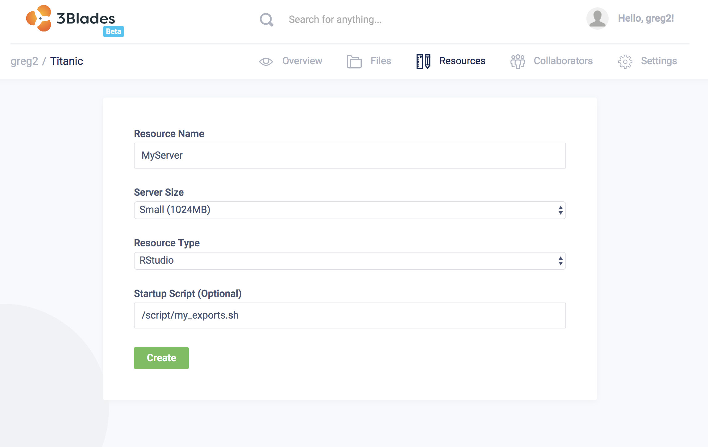

`Environment variables` are used to set specific values for keys in your user server container. Examples are usernames, working directories, package versions, among others.

All server types have the option to configure environment variables for your server container. Containers that are in the **Running** state will not have new environment variable settings set until the container has been restarted. Environment variables can only be set one server at a time. Only one server may be selected from the Jobs, Models or Workspaces list to change Environment variables.

To configure environment variables, add a `bash` script which exports environment variables to your session. Then, when starting your server, specify this script to add `export` statements to your user server session.

For example, a bash script to modify the `PATH` variable would look like so:

```bash
#!/bin/bash

export PATH=$PATH:/my/new/bin
```

Assuming this file is named `my_export.sh`, then a launching a server with this script would look something like the following screenshot:


