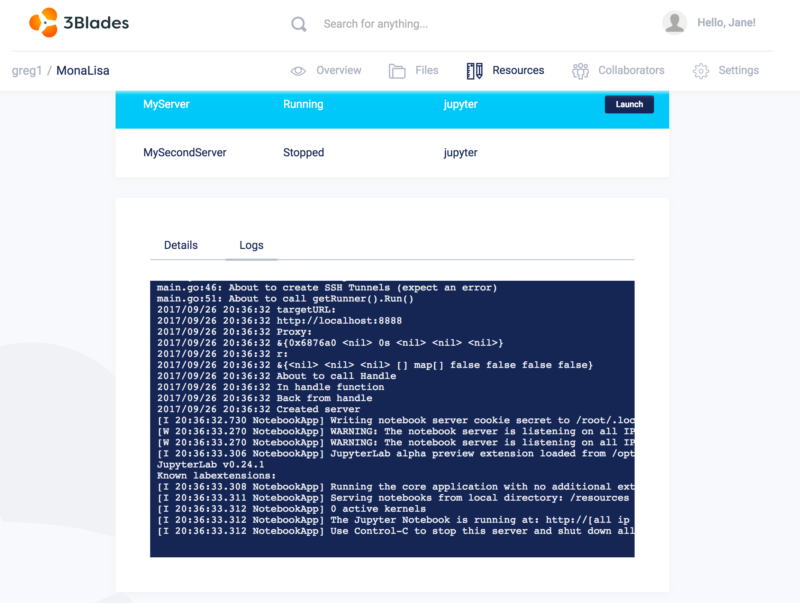

3Blades has the ability to stream `stdout` logs from servers. While a server is running, you can select the server to see streaming log output. This is particularly helpful for debugging.

To view streaming logs, select a running server from the Resources list and then click the Logs tab:

