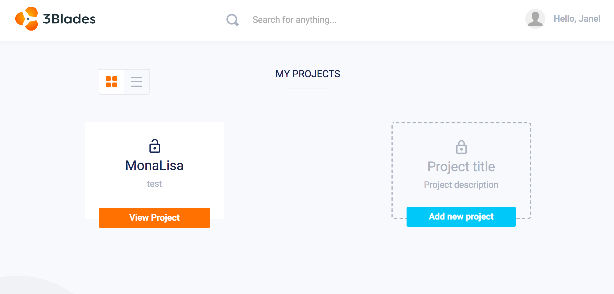
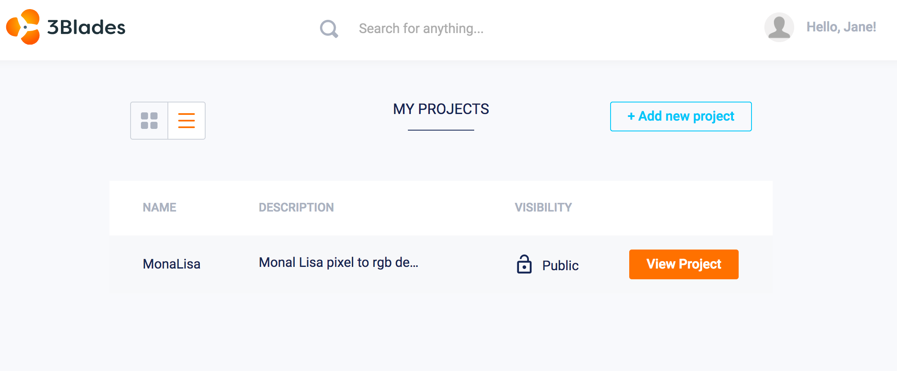
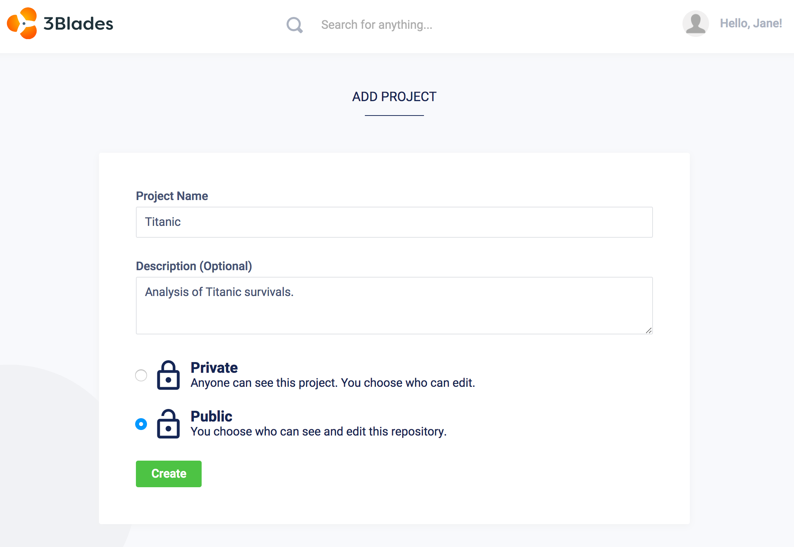
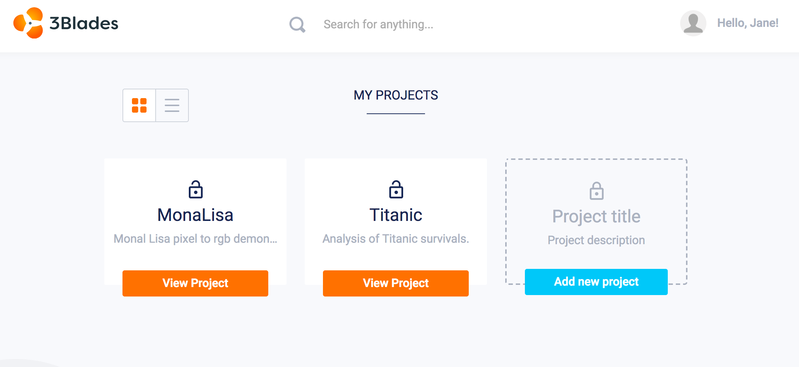

The first page you see after `Successfully logged into 3Blades` as a new user will be an empty `My Projects` page. Once you create a new project, this page allows you to view all of your active projects. The project list contains projects owned by you and projects where you are a collaborator.

Follow these steps to get up and running with your first project:

### Add **New Project**

To create a new project, click on the **Add New Project** button on the blank project card:

You can also click on the plus icon on the top navigation bar and select New Project:

### Add **Project Details**

Once your new project has been selected, you should see a web form which will allow you to set your project attributes. Project attributes are:

---
- Project owner
- Project name
- Project description
- Public project or private project
---

**Public** projects are available to everyone that has a valid 3Blades account with read-only privileges. **Private** projects are not visible to anyone unless access is provided explicitly via Collaborators.

### Confirm New Project with **Create** button

After creating your project, you should see your new project listed in your dashboard:

That's it! You can now add files to your project, manage collaborators and launch workspaces to start working on your data science project, right away.

[Fork us in Github and send Pull Request to suggest edits](https://github.com/3blades/3blades).
