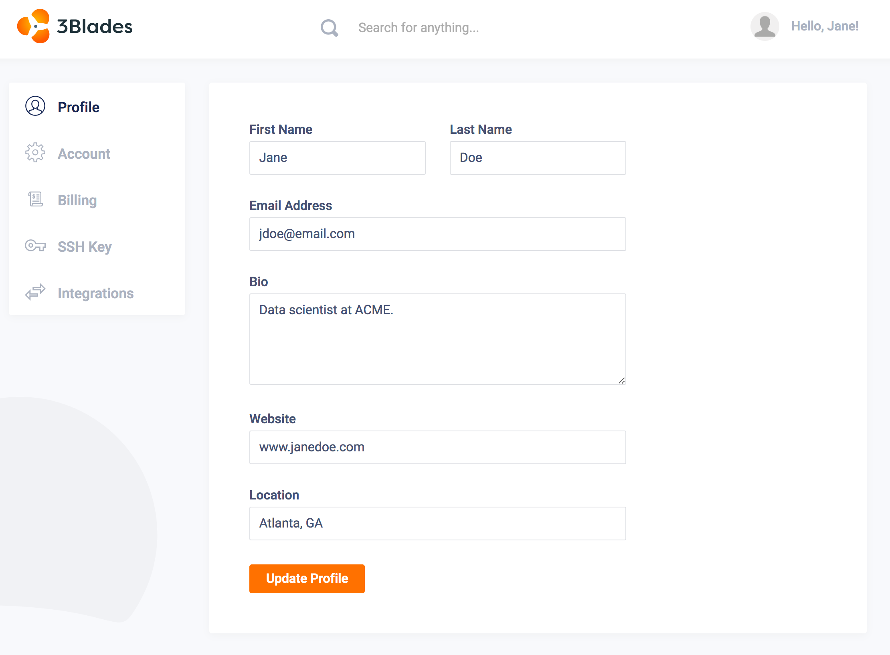
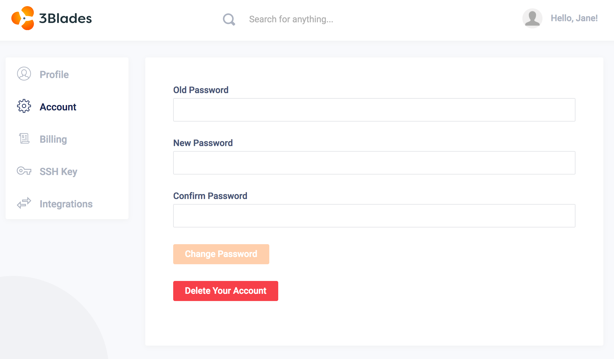
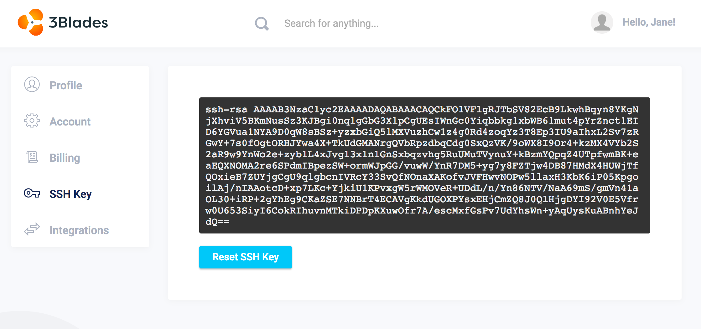

Account settings allow users to edit their account. Options to update in Account Settings are:

- Profile
- Settings
- Emails
- SSH Keys

## Profile

Public profiles are useful to confirm certain user attributes, particularly when adding, removing or editing project collaborators. Update profile attributes by clicking on Profile --> Edit Profile. You can also navigate directly by clicking on Settings in your profile's context menu:

Attributes that can be modified include:

- Name
- Profile Avatar (picture)
- Email
- URL
- Company
- Location

Once attributes have been updated, simply click on the **Update** button at the bottom of the section.

## Account

Account Settings allow users to change attributes that may affect the behavior of the account in the system. In this section, the user can:

- **Change password**: to change user password the user needs to be able to confirm the current password.
- **Change username**: modifying the username may affect how other users identify your account. For example, if the user is a collaborator in another project, then the user may not be recognized as one of the collaborators and could be deleted from the project. We recommend changing this value with caution.
- **Delete account**: deleting your account will also delete all projects, files, and workspaces associated with that account. If the account owns a team, then the account needs to transfer the team to another account before proceeding. Even if you do not plan on using 3Blades anymore, we recommend backing up your data before continuing with account deletion.

## SSH Keys

SSH keys are used by the system to authenticate and encrypt 3Blades user server containers to external servers. This section displays your public SSH key. You can also recreate your key if you think it has been compromised or if you need to comply with key refresh requirements.

!!! warning "SSH Security"
    We take your security very seriously. We are currently using the battle tested **cryptography** package from [Python Cryptographic Authority](https://github.com/pyca).
