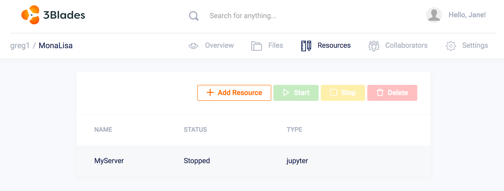
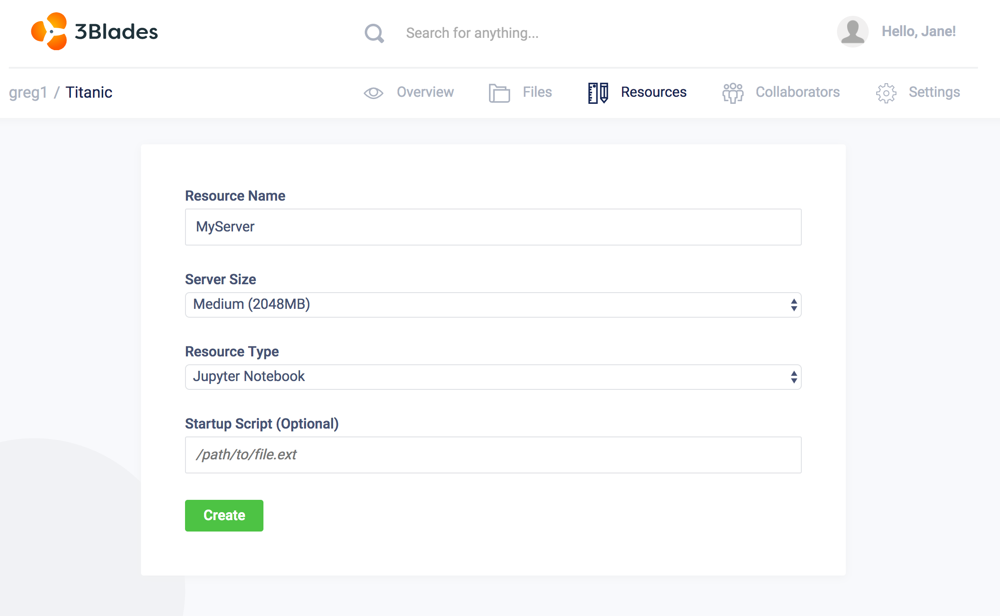

Servers may be launched by:

1. Creating new Notebook servers
2. Starting notebook servers that are currently in the Stopped state.
3. Restarting Notebook servers that need a restart to reflect edits.

!!! note "Server Resources"
    Notebook servers are run with Docker containers. As such, resources that are used to run the container are set to a minimum amount of resources. Server types are currently defined by virtual CPU cycles and random access memory (RAM). GPUs use the the memory available on the GPU.

## New Notebook Servers

Notebook servers are run using opinionated images of `Jupyter Notebooks` and `RStudio`. Launching a new workspace consists of selecting the image you want to base your workspace on and the workspace type, i.e. resources, that you would like to use to run your container.

To launch a new workspace, click on the **Create** after selecting **Jupyter Notebook** or **RStudio** as a type:

Once you have clicked on the **Create** button, you will see a page where to confirm:

  * `Resource Name`: any alphanumeric character name, limited to 255 characters.
  * `Server Size`: memory (RAM) that you wish to allocate to your container.
  * `Resource Type`: image that container will be based on when run. Jupyter Notebooks or RStudio are both valid options.
  * `Startup Script`: optional script file to use when launching a container.
  * (Coming soon) `Environment Variables`: add environment variables to your servers as key/value pairs.

