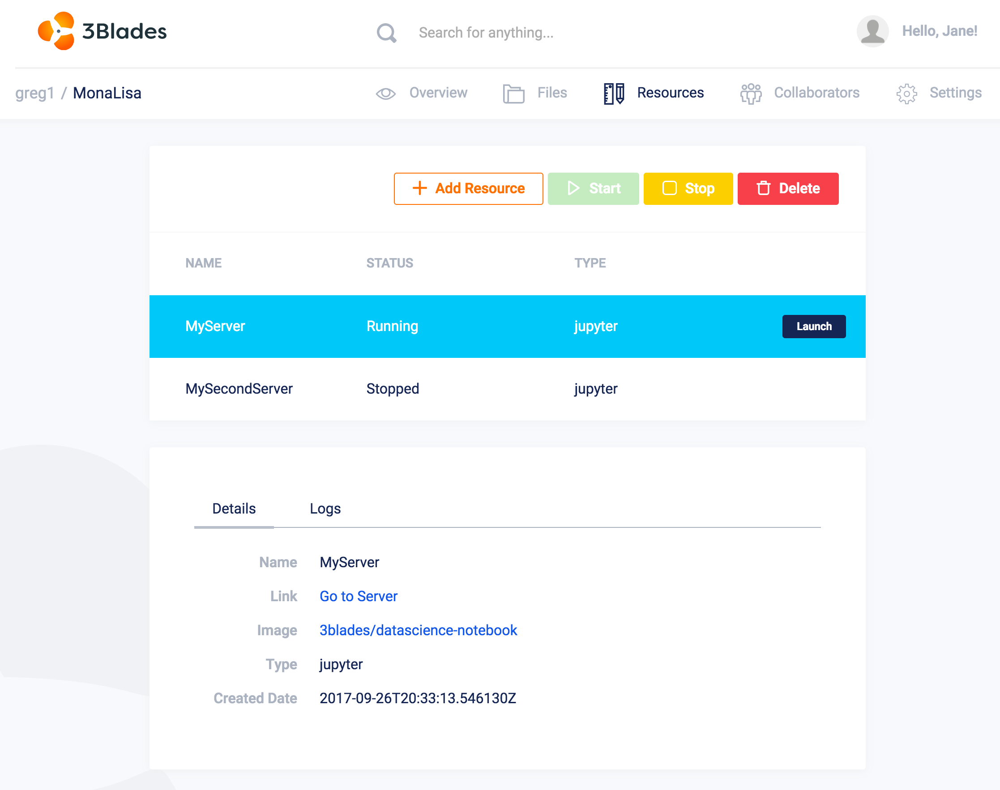

**Jupyter** and **RStudio** servers are servers that are used to run Jupyter Notebook and the RStudio IDE, respectively.

!!! note "Coming Soon!"
    **Cron**: server types used to automate certain tasks. Job servers use a simple scheduler to run jobs at predetermined times. Once the job finishes, the server is gracefully shut down. **Restful**: model server is used to publish functions as RESTful endpoints. Model servers stay in the *Running* state unless stopped or terminated by an event or a user.

Workspace images, in particular, are highly customizable. We offer some opinionated workspace images by default, but we encourage our users to create their own docker images to use as workspaces.

After launching a new server, the user has the option to change server state:

- Servers in the **Running** state can be stopped by clicking on the *Actions* ---> *Stop* button.
- Servers in the **Stopped** state can be started by clicking on the *Start* button.
- Servers in the **Stopped** or **Running** state can be terminated by clicking on the **Terminate** option in the *Action* drop-down menu.
- If more than one server instance has been selected, then the user has the option to terminate multiple instances at once using the *Action* drop-down menu button.

Below is an example screenshot where a user has two workspace instances running from within their project:

