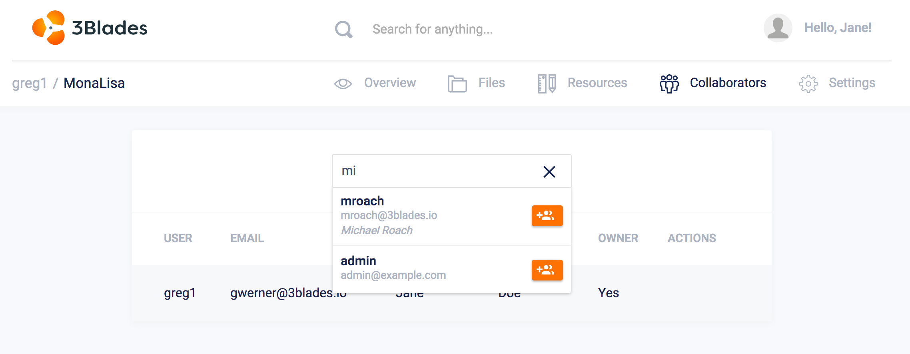

Project **collaborators** allow you to share public and private projects with other members. Other members can have *Edit* or *Read* permissions.

There can only be one project owner at a time.

To add a new project collaborator, you can either use the **Add** icon on the top navigation bar (which allows you to add items depending on context) or use the collaborator's option in the sidebar:

Once you find the user in search text box, the **Add Collaborator** button will add the user to the project with either **Edit** or **Read** permissions.
